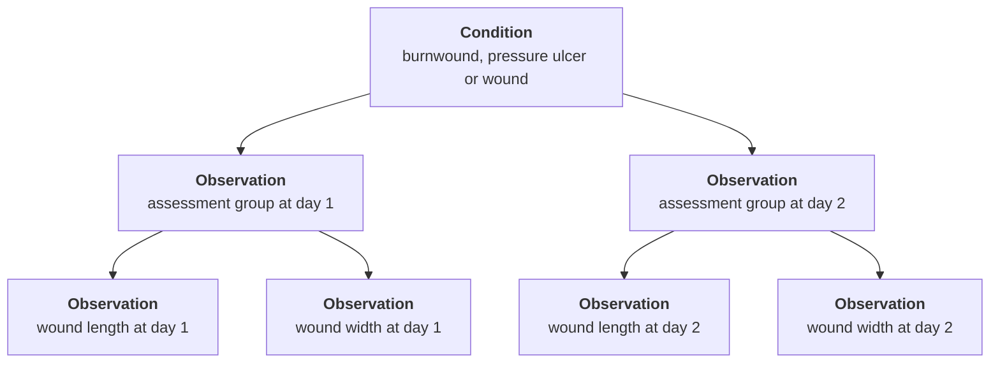

# The wound zibs (Burnwound, PressureUlcer and Wound)
## Introduction
There are three closely related zibs that deal with wounds: Burnwound, PressureUlcer and Wound. The modeling of these zibs in FHIR is not trivial and requires multiple profiles on different resource types. However, these three zibs are modelled in the same way and partially overlap in the concepts they define, so the FHIR modeling is also highly similar and there is partial re-use of profiles.

## Condition vs. Observation
All three wound zibs are about the wounds _themselves_ (their SNOMED definition codes are disorders), as apposed to point-in-time assessments of their state. However, they all _contain_ point-in-time assessments, like wound length, width, depth, etc. From a zib perspective, this makes sense: a zib is a conceptual model of the clinical concept, and evolution over time is out of scope.

However, for a concrete implementation in FHIR, this aspect becomes relevant. In FHIR, disorders are modeled using the Condition resource, which allows long-term tracking of the condition. The assessment aspects however, are modeled using the Observation resource, or the DocumentReference resource in case of a wound photo.

For this reason, these three wound zibs are mapped onto multiple resources: there is a focal profile on Condition, while all point-in-time properties are mapped onto Observation and DocumentReference profiles. The Observation/DocumentReference resources resulting from the same assessment are organized by grouping them with a single Observation resource (profile [zib-wounds.WoundCharacteristics](http://nictiz.nl/fhir/StructureDefinition/zib-wounds.WoundCharacteristics)). This model allows to track multiple distinct assessment moments over time in connection with the Condition.

### Cardinality constraints
This approach means that the Condition resources combine multiple instances of the zib about the same real-world wound. Each assessment Observation resource in essence represents a single instance (limited to the observable properties of the zib).

For this reason, the cardinality restrictions in FHIR are not the same as in the zib:

* The zib restricts most observable properties to a cardinality of `0..1`. This restriction is applied to the assessment profile in FHIR. However, this model allows for `0..*` assessments per Condition, so these observable properties can occur more than once as well.
* Similarly, the zibs define a Comment concept with a cardinality of `0..1`. Since the Condition resource represents multiple instances, the equivalent `Condition.note` element is not constrained in a similar fashion.

