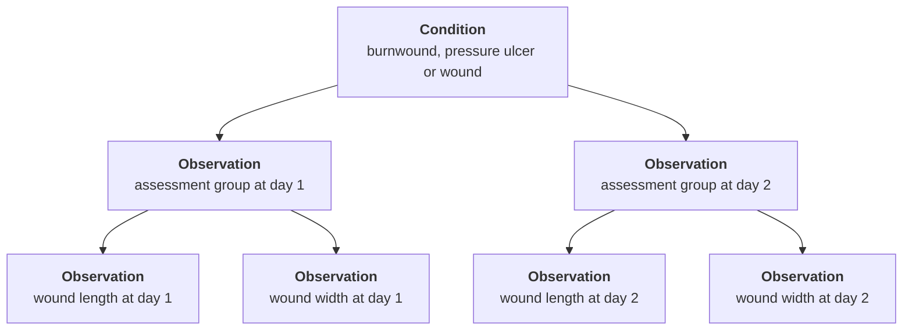
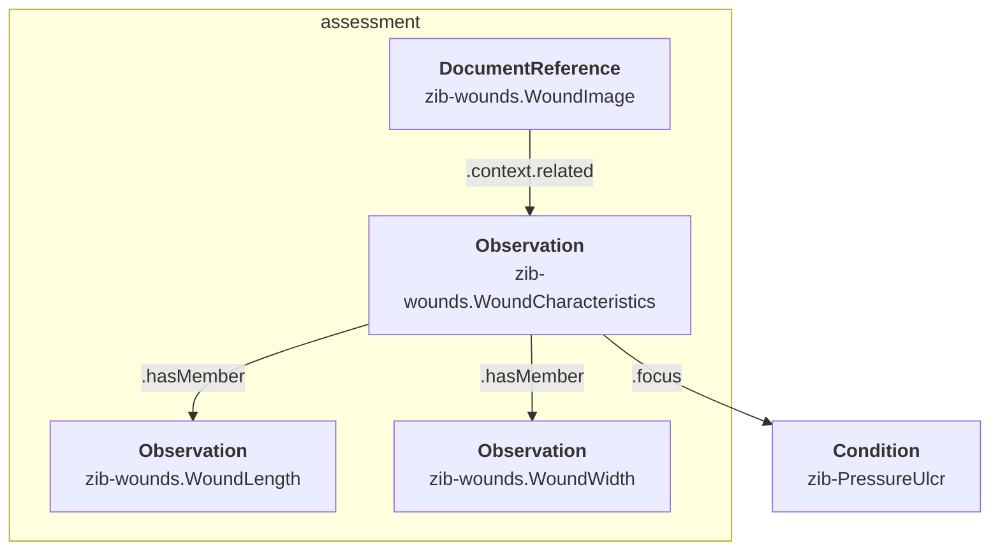

# The wound zibs (Burnwound, PressureUlcer and Wound)
## Introduction
There are three closely related zibs that deal with wounds: Burnwound, PressureUlcer and Wound. The modeling of these zibs in FHIR is not trivial and requires multiple profiles on different resource types. However, these three zibs are modelled in the same way and partially overlap in the concepts they define, so the FHIR modeling is also highly similar and there is partial re-use of profiles.

## Condition vs. Observation
All three wound zibs are about the wounds _themselves_ (their SNOMED definition codes are disorders), as apposed to point-in-time assessments of their state. However, they all _contain_ point-in-time assessments, like wound length, width, depth, etc. From a zib perspective, this makes sense: a zib is a conceptual model of the clinical concept, and evolution over time is out of scope.

However, for a concrete implementation in FHIR, this aspect becomes relevant. In FHIR, disorders are modeled using the Condition resource, which allows long-term tracking of the condition. The assessment aspects however, are modeled using the Observation resource, or the DocumentReference resource in case of a wound photo.

For this reason, these three wound zibs are mapped onto multiple resources: there is a focal profile on Condition, while all point-in-time properties are mapped onto Observation and DocumentReference profiles. The Observation/DocumentReference resources resulting from the same assessment are organized by grouping them with a single Observation resource (profile [zib-wounds.WoundCharacteristics](http://nictiz.nl/fhir/StructureDefinition/zib-wounds.WoundCharacteristics)). This model allows to track multiple distinct assessment moments over time in connection with the Condition.

### Cardinality constraints
This approach means that the Condition resources combine multiple instances of the zib about the same real-world wound. Each assessment Observation resource in essence represents a single instance (limited to the observable properties of the zib).

For this reason, the cardinality restrictions in FHIR are not the same as in the zib:

* The zib restricts most observable properties to a cardinality of `0..1`. This restriction is applied to the assessment profile in FHIR. However, this model allows for `0..*` assessments per Condition, so these observable properties can occur more than once as well.
* Similarly, the zibs define a Comment concept with a cardinality of `0..1`. Since the Condition resource represents multiple instances, the equivalent `Condition.note` element is not constrained in a similar fashion.

## Overlap and re-use of profiles
The three wound zibs overlap in some of the observable properties that they define. Since each observable property is represented by a distinct Observation or DocumentReference resource, the same profile can be used for more than one zib.

When this is the case, the title of the profile is prefixed with "zib-wounds" rather than the common pattern of "zib-[zib name]". E.g. instead of a profile with title "zib-PressureUlcer.WoundLength", there's a profile with title "zib-wounds.WoundLength", because this concept is present in zib Wound as well.

This table summarizes the observable properties that occur in more than one of these zibs:

| Profile                             | Concept name             | Burnwound | PressureUlcer | Wound |
| ----------------------------------- | ------------------------ | --------- | ------------- | ----- |
| *zib-wound.WoundCharacteristics*    | *see remark below*       | *x*       | *x*           | *x*   |
| zib-wounds.WoundDepth               | WoundDepth               | x         | x             | x     |
| zib-wounds.WoundLength              | WoundLength              |           | x             | x     |
| zib-wounds.WoundWidth               | WoundWidth               |           | x             | x     |
| zib-wounds.DateOfLastDressingChange | DateOfLastDressingChange | x         | x             | x     |
| zib-wounds.WoundImage               | WoundImage               | x         | x             | x     |

The zib-wounds.WoundCharacteristics profile on Observation is the "grouper" Observation that bundles all observable properties from one assessment moment. It defines references to the profiles for all Observable properties of all these three zibs, but not all of them may be relevant.

## References between resources.
As stated above, the focal resource for each of these zibs is a Condition profile, while the observations done during an assessment are represented using Observation and DocumentReference resources.

These resources reference each other in the following way:

* The zib-wounds.WoundCharacteristics Observation is a "panel type" Observation. All the observed properties like width, height and colour are members of this panel, so these are references using `Observation.hasMember`. The exception is the wound image:
* zib-wounds.WoundImage is a profile on DocumentReference. In FHIR, the reference between a DocumentReference and an Observation resource is made using `DocumentReference.context.related`, so it is the zib-wounds.WoundImage resource that refers to the zib-wounds.WoundCharacteristics resource.
* The zib-wounds.WoundCharacteristics Observation is linked to the Condition resource using the `Observation.focus` element.

