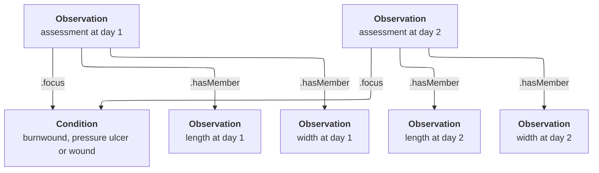

# The wound zibs (Burnwound, PressureUlcer and Wound)
## Introduction
There are three closely related zibs that deal with wounds: Burnwound, PressureUlcer and Wound. The modeling of these zibs in FHIR is not trivial and requires multiple profiles on different resource types. However, these three zibs are modelled in the same way and partially overlap in the concepts they define, so the FHIR modeling is also highly similar and there is partial re-use of profiles.

## Condition vs. Observation
As evidenced by their SNOMED definition codes, all three wound zibs are about the wounds _themselves_ (disorders), they are not just point-in-time assessments of their state. However, they all _contain_ point-in-time assessments. From a zib perspective, this makes sense: a zib is a conceptual model of the clinical concept and doesn't deal with evolution over time.

However, for a concrete implementation in FHIR, this aspect becomes relevant. In FHIR, disorders _themselves_ are modeled using a Condition resource, which allows long-term tracking of the condition. The assessment aspects however, are modeled using the Observation resource, and the DocumentReference resource in case of a wound photo.

For this reason, these zibs are mapped onto multiple resources: there is a focal profile on Condition, while all point-in-time properties are mapped onto Observation and DocumentReference profiles. The Observation/DocumentReference resources resulting from the same assessment are grouped using a single Observation resource (profile [zib-wounds.WoundCharacteristics](http://nictiz.nl/fhir/StructureDefinition/zib-wounds.WoundCharacteristics)). This model allows to track multiple distinct assessment moments over time in connection with the Condition.

Because of these difference between the conceptual model and the zib and concrete model in FHIR, the cardinality restrictions of the zib do not directly translate:

* The zib restricts all observable properties to have a cardinality of `0..1`, but in FHIR this is interpreted as a cardinality constraint _per assessment_. Since there may be `0..*` assessments, effectively all observable properties may be present `0..*` as well.
* Similarly, the zibs define a Comment concept with a cardinality of `0..1`. This is interpreted as a cardinality for an instance of the conceptual model of the zib. The Condition resource however effectively can represent multiple instances, so the equivalent `Condition.note` element is not constrained in a similar fashion.

