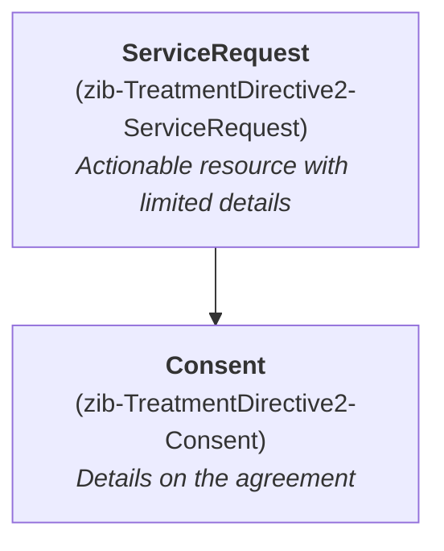

# TreatmentDirective2
## Consent vs. ServiceRequest
At the time of writing, there is no obvious way to represent treatment directives in FHIR. The Consent resource [states that](https://www.hl7.org/fhir/R4/consent.html#scope) it's intended to cover the use case of "Advance Care Directives: Consent to instructions for potentially needed medical treatment (e.g. DNR)", but that this use case is not modeled yet.

Meanwhile there is [discussion in the FHIR community](https://jira.hl7.org/browse/FHIR-50903) if the ServiceRequest would be a better fit. A ServiceRequest is an actionable resource, and it supports _directive_ as an `.intent`. The Consent resource on the other hand is about a consumer choice, which is not the same as an agreement as a treatment directive defines. Indeed, the PACIO Advance Directive Interoperability IG [has adopted ServiceRequest](https://build.fhir.org/ig/HL7/fhir-pacio-adi/StructureDefinition-ADI-PMOCPRServiceRequest.html) to model a(relative simple) DNR directive.

However, the zib is a more elaborate model than what the ServiceRequest resource (or the Consent resource) can cover. For this reason, the choice has been made to model the zib onto both resources.

* The ServiceRequest resource (zib-TreatmentDirective2-ServiceRequest) should be regarded the actionable resource. It covers the decision to perform or not perform a specific treatment, and information if this decision is still active.
* The Consent resource (zib-TreatmentDirective2-Consent) is the resource containing the details of the agreement. It duplicates the information that is also present in the ServiceRequest. The Consent resource can be referenced from the ServiceRequest resource.

## Modifier extension "SpecificationOther"
Both the Consent and the ServiceRequest resource include the option to indicate that whether the treatment should be performed:

* For Consent, `Consent.provision.type` can be either set to _allow_ or _deny_.
* For ServiceRequest, `ServiceRequest.doNotPerform` can either be set _true_ or _false_.

However, this binary choice is not granular enough for the zib, which allows for the TreatmentDecision to be "Other". In this case, a textual treatment decision must be provided using the SpecificationOther concept.

As neither FHIR resource supports this situation, a [modifier extension](https://www.hl7.org/fhir/R4/extensibility.html#modifierExtension) is created, named "ext-TreatmentDirective2.SpecificationOther". If present, this extension carries the textual decision about the treatment. If this modifier extension is present, it's value overrides `Consent.provision.type` and `ServiceRequest.doNotPerform`. Sending systems SHOULD refrain from setting these values when the treatment decision is "Other", and receiving systems MUST present this information to the user.

Note that this must be a modifier extension instead of a regular extension, as the resource cannot be safely processed without interpreting the information in the extension.