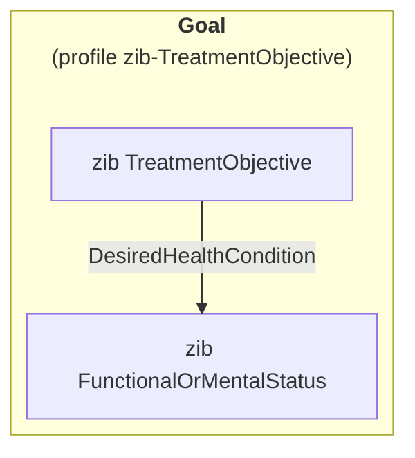
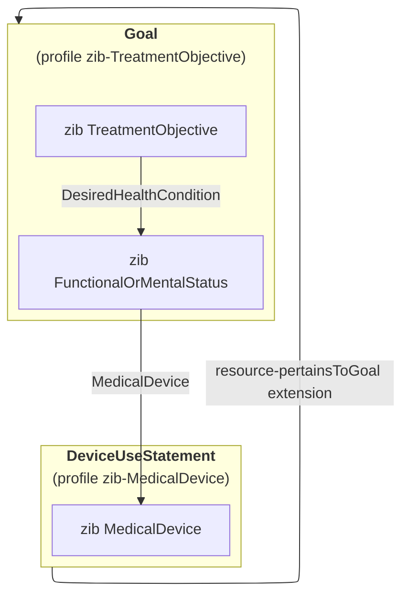

# TreatmentObjective
## Zibs TreatmentObjective and FunctionalOrMentalStatus as one Goal resource
Zib TreatmentObjective can define the desired treatment result as a reference to zib FunctionalOrMentalStatus. Zib FunctionalOrMentalStatus in this context is thus a goal to aim for. One could argue that this is not an actual reference; the data model of zib FunctionalOrMentalStatus _is_ the goal.

Indeed in FHIR, this is actually the case. Treatment objectives are represented by the Goal resource, which accomodates the data present in both zib TreatmentObjective *and* the referenced zib FunctionalOrMentalStatus. Hence, in FHIR there is no reference; both zibs are mapped to the same Goal resource.

Since the entry point is zib TreatmentObjective, the profile is called `zib-TreatmentObjective`, and doesn't mention zib FunctionalOrMentalStatus. Perhaps somewhat confusingly, there is also a profile called `zib-FunctionalOrMentalStatus`, but it plays no role in this scenario; it represents the standalone interpretation of zib FunctionalOrMentalStatus, which is an observed functional or mental status. 

## Referencing zib MedicalDevice
Zib FunctionalOrMentalStatus, in turn, can reference zib MedicalDevice to indicate any aid(s) the patient has to reduce the impact of the disability or disorder. Within the context of zib TreatmentObjective, this reference is interpreted as the _intent_ to use the device rather than actual use.

In FHIR, zib MedicalDevice is represented using the DeviceUseStatement resource (profile `zib-MedicalDevice`, accompanied by a Device resource). Used within the context of zib TreatmentObjective, this resource will usually have a `DeviceUseStatement.status` set to _intended_.

To represent the reference between zib FunctionalOrMentalStatus-as-TreatmentObjective and zib MedicalDevice in FHIR, a reference between the Goal and the DeviceUseStatement is required. The resource-pertainsToGoal core extension is the preferred way to do so. However, it points in the opposite direction than the zib reference; whereas the zib creates a reference from FunctionalOrMentalStatus to MedicalDevice, this extension makes the reference from the DeviceUseStatement to the Goal resource.

